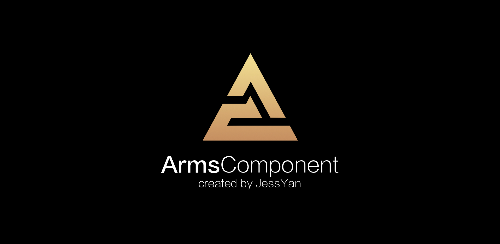
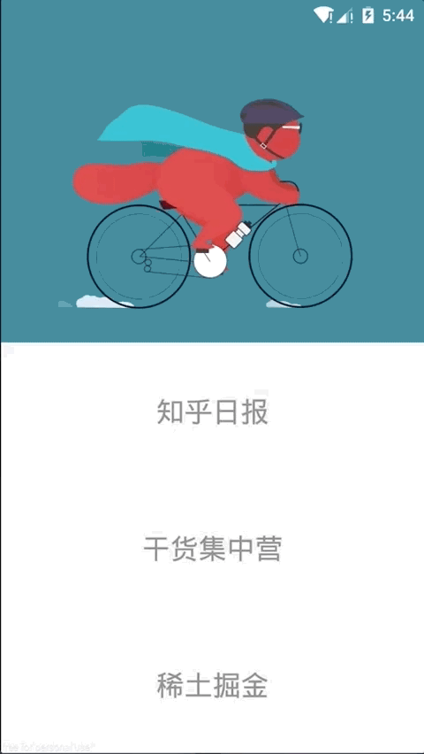

<p align="center">
  <a href="https://travis-ci.org/JessYanCoding/ArmsComponent">
    
  </a>
  <a href="https://developer.android.com/about/versions/android-4.0.html">
    
  </a>
  <a href="http://www.apache.org/licenses/LICENSE-2.0">
    
  </a>
  <a href="https://www.jianshu.com/u/1d0c0bc634db">
    
  </a>
  <a href="https://shang.qq.com/wpa/qunwpa?idkey=7e59e59145e6c7c68932ace10f52790636451f01d1ecadb6a652b1df234df753">
    
  </a>
</p>


## A complete android componentization solution, powered by [MVPArms](https://github.com/JessYanCoding/MVPArms) (MVPArms 官方快速组件化方案).

## Architectural
<p align="center">
  
</p>  

## Overview
<p align="center">
  
</p>  

## Wiki
[**Wiki Documents (开发前必看!!!)**](https://github.com/JessYanCoding/ArmsComponent/wiki)

## Notice
[文章介绍](https://www.jianshu.com/p/f671dd76868f)

[一键搭建整体组件架构, 让您体验纯傻瓜式的组件化开发 (**开发神器, 不看后悔!**)](https://github.com/JessYanCoding/ArmsComponent-Template)

[常见 Issues](https://github.com/JessYanCoding/ArmsComponent/wiki/Issues)

[意见收集](https://github.com/JessYanCoding/ArmsComponent/issues/1)

[ArmsComponent 依赖于 MVPArms, 学习好 MVPArms 才有利于使用 ArmsComponent](https://github.com/JessYanCoding/MVPArms/wiki)

## About Me
* **Email**: <jess.yan.effort@gmail.com>
* **Home**: <http://jessyan.me>
* **掘金**: <https://juejin.im/user/57a9dbd9165abd0061714613>
* **简书**: <https://www.jianshu.com/u/1d0c0bc634db>

## License
```
 Copyright 2017, jessyan

   Licensed under the Apache License, Version 2.0 (the "License");
   you may not use this file except in compliance with the License.
   You may obtain a copy of the License at

       http://www.apache.org/licenses/LICENSE-2.0

   Unless required by applicable law or agreed to in writing, software
   distributed under the License is distributed on an "AS IS" BASIS,
   WITHOUT WARRANTIES OR CONDITIONS OF ANY KIND, either express or implied.
   See the License for the specific language governing permissions and
   limitations under the License.
```
